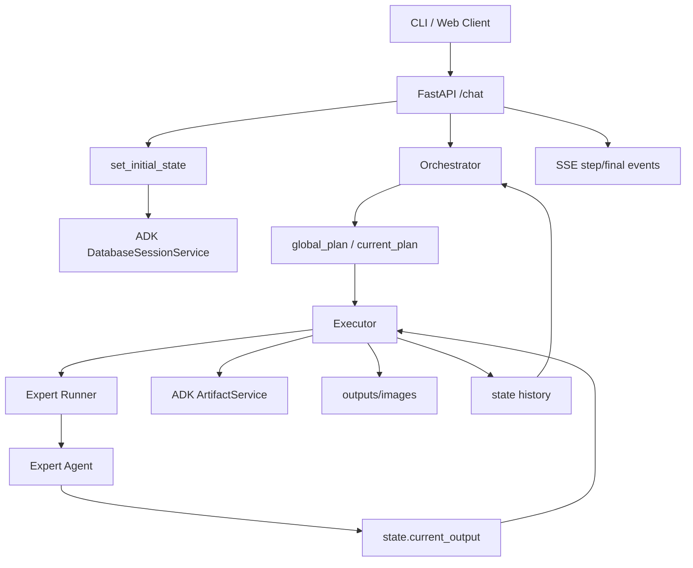

# AI Tutor v2 系统架构 Review

本文档用于 review 当前 `ai_tutor_v2` 的系统架构。它描述的是当前代码状态，不代表最终目标设计。

## 1. 总体定位

`ai_tutor_v2` 是一个基于 Google ADK 的多智能体 tutor 系统。外层由 FastAPI 提供 HTTP/SSE 接口，内部通过 ADK `Runner`、`SessionService`、`ArtifactService` 组织任务状态、专家 agent 调用和文件产物。

当前系统的核心工作流是：

1. 前端或 CLI 创建 session。
2. 用户通过 `/chat` 提交任务、图片或文档。
3. API 层初始化 ADK session state。
4. `Orchestrator` 根据用户任务和历史 state 规划下一步。
5. `Executor` 读取当前规划，调用对应 expert agent。
6. expert agent 执行任务并写入统一的 `current_output`。
7. `Executor` 汇总输出，保存 artifact 到本地输出目录。
8. `/chat` 通过 SSE 返回中间步骤和最终结果。



## 2. 主要目录与职责

| 路径 | 职责 |
| --- | --- |
| `server/main.py` | FastAPI 应用入口，注册路由、CORS、数据库初始化和 lifespan。 |
| `server/routers/chat.py` | 主工作流 HTTP 接口，包括 `/session/create`、`/chat`、`/file/download`。 |
| `server/agents_manager.py` | 初始化 ADK session/artifact service，注册 expert agents 和对应 runner。 |
| `server/utils/common.py` | 初始化 session state，处理上传文档转 Markdown 和 artifact 写入。 |
| `src/agents/orchestrator/orchestrator_agent.py` | 规划层，生成全局规划和单步规划。 |
| `src/agents/executor/executor_agent.py` | 执行层，读取 `current_plan`，调用 expert runner，维护执行历史。 |
| `src/agents/experts/` | 各类专家 agent，实现搜索、图片理解、数学视频、PPT、文章等能力。 |
| `src/llm/model_factory.py` | ADK 模型适配层，统一 Gemini / LiteLLM 模型构造和 JSON 响应配置。 |
| `src/local_manim_voiceover_services/` | 项目内自定义 Manim voiceover 服务，目前包含 `ByteDanceService`。 |
| `conf/jsons/agent.json` | expert agent 的名称、启用状态、能力描述和参数说明。 |
| `conf/jsons/system.json` | 模型、端口、session、日志、OAuth、Stripe 等系统配置。 |
| `apps/art_cli.py` | CLI 前端，负责创建 session、发送 `/chat` 请求并消费 SSE。 |
| `docs/` | 架构、优化记录和 review 文档。 |

## 3. 服务入口和请求流

### 3.1 后端服务

后端入口是 `server/main.py`，创建 FastAPI app 后挂载这些路由：

- `chat.router`：工作流主入口。
- `auth.router`：认证相关接口。
- `billing.router`：订阅和支付相关接口。
- `user.router`：用户相关接口。
- `home_page.router`：首页资源相关接口。

`server/main.py` 在启动时还会：

- 创建 SQLAlchemy 业务表。
- 设置 ADK session 数据库的 SQLite WAL 模式。
- 注册 CORS 白名单。

### 3.2 CLI 前端

`apps/art_cli.py` 是当前最直接的前端入口。它的流程是：

1. `POST /session/create` 创建 session。
2. `POST /chat` 发送用户消息、图片和文档。
3. 读取 `text/event-stream`，打印 `step`、`final`、`error` 事件。

CLI 当前不会直接下载 artifact 文件，而是显示最终文本、base64 媒体数量和可下载文件名。

## 4. Session State 与 Artifact 协议

### 4.1 两类数据库

当前系统有两套 SQLite 存储：

| 存储 | 位置 | 用途 |
| --- | --- | --- |
| 业务数据库 | `database/database.db` | 用户、验证码、邀请码、会话管理等 SQLAlchemy 表。 |
| ADK session 数据库 | `database/session_database/session_database.db` | ADK session、event、state。 |

业务数据库由 `server/database.py` 和 `server/models.py` 管理。

ADK session 数据库由 `DatabaseSessionService` 管理。系统对 session 写入增加了 `database_op_with_retry`，用于缓解 SQLite lock/busy 问题。

### 4.2 Artifact 存储

当前 `server/agents_manager.py` 使用：

```python
artifact_service = InMemoryArtifactService()
```

这意味着 artifact 二进制先保存在进程内存中。Executor 执行完 expert 后，会把 artifact 从 `ArtifactService` 读取出来，再落盘到 `outputs/images`。

这个设计对本地开发简单，但有几个 review 点：

- 服务重启后，内存中的 artifact 会丢失。
- 多 worker 或多进程部署时，artifact 不共享。
- `/file/download` 依赖当前进程内的 `artifact_service`，历史文件虽然可能落盘了，但下载接口读的是 artifact service。

### 4.3 关键 state 字段

`set_initial_state` 会初始化或继承这些关键字段：

| 字段 | 含义 |
| --- | --- |
| `user_prompt` | 当前用户任务。上传文件会追加文件名说明。 |
| `global_plan` | Orchestrator 生成的全局规划。 |
| `current_plan` | 当前要执行的单步规划。 |
| `current_parameters` | Executor 写入的当前 expert 调用参数。 |
| `current_output` | expert 执行后的统一输出。 |
| `step` | 已执行步骤数，多轮对话中累加。 |
| `input_artifacts` | 当前用户上传的图片、文档及转换产物。 |
| `new_artifacts` | 当前步骤新增 artifact，用于下一轮规划。 |
| `artifacts_history` | 每一步输出 artifact 的历史。 |
| `summary_history` | 每一步规划目标摘要。 |
| `message_history` | 每一步执行结果摘要。 |
| `text_history` | 每一步详细文本输出。 |
| `search_count` | 当前 session 已搜索次数。 |

当前 state 协议主要靠注释和约定维护，还没有集中定义的 schema。

## 5. Orchestrator / Executor 分层

### 5.1 Orchestrator

`Orchestrator` 的职责是生成规划。它包装了 `OrchestratorAgent`，内部包含：

- `PlannerAgent`：输出 JSON 规划。
- `CriticAgent`：在 `plan_critic_iter_num > 0` 时检查规划。
- `StopChecker`：根据 critic 输出判断 roleplay 是否停止。

当前 `conf/jsons/system.json` 中：

```json
"plan_critic_iter_num": 0
```

所以默认情况下不启用 planner/critic 多轮优化，主要是单次 planner 输出。

一个重要设计是 `internal=True`：Orchestrator 会复制主 session 到内部 session，在内部 session 中完成规划对话，避免 planner/critic 的中间过程污染主 session。最终只把 `global_plan` 或 `current_plan` 写回主 session。

### 5.2 Executor

`Executor` 的职责是执行 `current_plan`：

1. 从主 session 读取 `state.current_plan`。
2. 校验 `next_agent` 是否存在。
3. 校验 `parameters.input_name` 是否指向已存在 artifact。
4. 写入 `state.current_parameters`。
5. 通过 `expert_runners[next_agent]` 调用 expert。
6. 从 `state.current_output` 读取 expert 结果。
7. 保存 artifact 到本地输出目录。
8. 更新 `step`、`new_artifacts`、`artifacts_history`、`summary_history`、`message_history`、`text_history`。
9. 清空 `current_plan`，防止重复执行。

Executor 不关心 expert 内部如何实现，只依赖 `current_output` 协议。

## 6. Expert Agent 注册与输出协议

### 6.1 注册机制

expert agent 的展示能力来自 `conf/jsons/agent.json`。Orchestrator 的 prompt 会读取其中启用的 expert，形成可用 agent 列表。

实际可执行对象在 `server/agents_manager.py` 中注册：

```python
expert_agents = {
    "ImageUnderstandingAgent": image_understanding_agent,
    "ScienceAgent": science_agent,
    "MathVideoGenerationAgent": math_video_generation_agent,
    ...
}
```

然后为每个 expert 创建 ADK `Runner`。

需要注意：`agent.json` 中 `enable=false` 的 agent 仍可能在 `agents_manager.py` 中被实例化并注册 runner。默认 Orchestrator 不应选择禁用 agent，因为 prompt 列表只包含 `enable=true` 的配置。

### 6.2 输出协议

expert agent 通过 ADK `EventActions(state_delta=...)` 写入 `state.current_output`。通常结构为：

```json
{
  "author": "AgentName",
  "status": "success | error",
  "message": "内部执行摘要",
  "message_for_user": "展示给用户的摘要",
  "output_artifacts": [
    {
      "name": "artifact 文件名",
      "description": "artifact 说明"
    }
  ],
  "output_text": "详细文本输出"
}
```

这个协议目前是隐式约定。不同 agent 的字段完整度不完全一致，Executor 需要做兼容判断。

## 7. 数学视频生成架构

数学视频是当前系统里最复杂的 expert 之一。

### 7.1 默认快速链路

当前 `MathVideoGenerationAgent` 默认指向 `FastMathVideoGenerationAgent`。

快速链路流程：

1. `FastMathVideoGenerationAgent` 用一次 LLM 调用生成结构化脚本 JSON。
2. `fast_template_renderer.py` 归一化脚本字段。
3. 本地固定 Manim 模板生成 `fast_math_scene.py`。
4. 可选生成旁白音频。
5. Manim 渲染无声视频。
6. 如果音频存在，用 ffmpeg mux 成带音轨视频。
7. 保存 `stepN_fast_math_video_output.mp4`。

快速链路的优势：

- 不执行 LLM 生成的任意 Manim 代码。
- LLM 只负责内容脚本，不负责工程代码。
- 渲染规格固定为低成本配置，减少失败和延迟。

当前旁白逻辑：

- 默认 `MATH_VIDEO_FAST_VOICEOVER=auto`。
- 有 `VOLCENGINE_APPID`、`VOLCENGINE_ACCESS_TOKEN`、`ffmpeg`、`ffprobe` 时尝试 TTS。
- 否则生成无语音字幕式视频。

### 7.2 旧版 legacy 链路

旧链路仍保留为 `legacy_math_video_generation_agent`，由 `SequentialAgent` 串联：

1. `SolutionAgent`
2. `ShotAgent`
3. `CodeGenerationAgent`
4. `RenderAgent`

可以通过参数回退：

```json
{
  "math_video_mode": "legacy"
}
```

或者：

```json
{
  "use_legacy": true
}
```

legacy 链路中，`CodeGenerationAgent` 的 prompt 会要求 LLM 生成完整 Manim 代码，再由 `RenderAgent` 在临时目录中执行 `manim -ql`。

### 7.3 ByteDanceService 的架构位置

当前项目内有自定义 TTS 服务：

```text
src/local_manim_voiceover_services/bytedance.py
```

它继承第三方包 `manim_voiceover.services.base.SpeechService`，实现火山引擎 TTS。

当前存在一个架构不一致点：

- 快速链路直接 import 项目内路径：`src.local_manim_voiceover_services.bytedance`。
- legacy 代码生成 prompt 仍要求生成代码 import：`manim_voiceover.services.bytedance`。

这说明 legacy prompt 仍保留了“把自定义服务复制到 `.venv`”的旧假设。后续如果明确不再复制到 `.venv`，需要把 prompt 和渲染子进程的 `PYTHONPATH` 设计统一到项目内 import。

## 8. 模型与配置层

系统配置主要来自：

- `conf/jsons/system.json`
- `conf/system.py`
- `conf/jsons/agent.json`
- `conf/agent.py`

### 8.1 LLM 适配

`src/llm/model_factory.py` 是当前模型适配的中心：

- Gemini 模型走 ADK 原生 `Gemini`。
- 非 Gemini 模型走 `LiteLlm`。
- OpenAI codex-like 模型会路由到 LiteLLM responses bridge。
- Gemini thinking level 和 OpenAI reasoning effort 在这里统一解析。
- JSON 响应模式也在这里统一构造。

这个文件是 ADK 2.3 升级后的关键稳定层。

### 8.2 Agent 能力配置

`conf/jsons/agent.json` 同时承担两类职责：

1. 控制 Orchestrator prompt 中哪些 expert 可见。
2. 提供 expert 能力描述和参数格式。

这让新 expert 的接入路径比较清晰，但也要求 `agent.json`、`server/agents_manager.py`、实际 class 名称保持一致。

## 9. 文件上传与文档处理

`/chat` 支持：

- 图片：`.png`、`.jpg`、`.jpeg`、`.bmp`
- 文档：PDF、Word、PPT、Excel、CSV、TXT、Markdown 等扩展名或 MIME

上传文件会先保存到：

```text
outputs/uploads
```

随后写入 `input_artifacts` 并保存到 ADK artifact service。

文档处理逻辑：

- PDF 通过 Doc2X 转 Markdown，并提取图像。
- DOCX 通过 pandoc 转 Markdown，并提取媒体文件。
- 转换后的 Markdown 和图像也会作为 artifact 加入 session。

这个设计让后续 agent 可以通过 artifact 名称读取文档内容或图像。

## 10. 对外返回与文件落盘

`/chat` 返回 SSE，事件类型包括：

- `step`：中间过程消息。
- `error`：工作流错误。
- `final`：最终结果。

最终结果包含：

```json
{
  "text": "整体总结",
  "final_output_text": "详细文本输出",
  "image": ["data:mime;base64,..."],
  "filenames": ["可下载文件名"]
}
```

命名上 `image` 实际也可能包含视频等媒体的 base64。代码里已有 TODO 提到这一点。

Executor 会把 artifact service 中的二进制保存到：

```text
outputs/images
```

当前 `outputs/videos` 目录存在，但注释说明暂未使用。

## 11. 当前 Review 重点

以下是建议优先 review 的架构点。

### 11.1 ArtifactService 是否应继续使用 InMemory

当前 `InMemoryArtifactService` 对本地单进程开发足够简单，但不适合多 worker、服务重启恢复和历史下载。

可选方向：

- 使用持久化 artifact service。
- 或者把 `outputs/` 落盘文件作为下载源，artifact service 只做本轮执行传递。

### 11.2 state 协议缺少显式 schema

`current_plan`、`current_parameters`、`current_output`、`output_artifacts` 等字段是系统核心协议，但现在主要靠注释约定。

风险：

- expert 输出字段不一致时，Executor 容易出现兼容分支。
- Orchestrator 规划参数和 expert 实际参数可能漂移。
- 新增 agent 时缺少统一校验。

可选方向：

- 定义 Pydantic schema。
- 给 `current_output` 和 `output_artifacts` 建统一数据模型。
- 为 `agent.json` 参数描述和实际 agent 输入做测试或校验。

### 11.3 Orchestrator 与 Executor 职责有重叠历史

Executor 内仍保留 `executor_replan_enabled` 路径，可以自己生成 plan。但当前配置为 false，主流程由 Orchestrator 负责规划。

需要确认：

- 是否保留 Executor replan 作为 fallback。
- 如果保留，需要保证它和 Orchestrator 使用同一套 agent 描述和参数协议。
- 如果不保留，可以简化 Executor。

### 11.4 数学视频的快速链路与 legacy 链路需要统一 import 假设

当前快速链路使用项目内 `ByteDanceService`，legacy prompt 仍指向 `manim_voiceover.services.bytedance`。

后续明确不复制到 `.venv` 后，需要统一：

- prompt 中的 import 路径。
- `RenderAgent` 临时代码运行时的 `PYTHONPATH`。
- TTS cache 目录和并发策略。

### 11.5 快速数学视频旁白失败会静音 fallback

当前 fast 链路中，任何旁白生成异常都会 fallback 到静音视频。

这保证了视频能产出，但会掩盖 TTS 问题。最近无声视频的问题就属于这一类。

建议 review：

- 旁白失败是否要对用户可见。
- 是否区分“用户显式允许静音”和“异常降级静音”。
- 是否在 `output_artifacts.description` 中记录失败原因。

### 11.6 业务数据库与 ADK session 数据库职责分离需要文档化

当前业务用户表、ConversationManagement 表和 ADK session service 并列存在。

需要确认：

- 前端的 conversation 概念和 ADK session 是否一一对应。
- 历史消息到底以业务表为准，还是以 ADK session events 为准。
- 下载历史 artifact 时如何从业务会话映射到 ADK session。

### 11.7 配置文件里包含占位 secret

`conf/jsons/system.json` 中有 OAuth、Stripe、secret key 等配置字段。当前看起来是占位值，但仍建议明确：

- 本地开发用默认占位。
- 生产环境必须通过环境变量或安全配置注入。
- 不在 git 中保存真实 secret。

## 12. 建议的后续整理顺序

建议按下面顺序推进，而不是一次性重构：

1. 固化 state/output schema，先不改业务行为。
2. 统一 `ByteDanceService` 的项目内 import 策略，停止依赖 `.venv` 手工复制。
3. 明确 artifact 持久化策略，解决重启和多 worker 问题。
4. 为 `MathVideoGenerationAgent` 快速链路增加 TTS 失败可观测性。
5. 清理已禁用 expert 的注册关系，减少 prompt 可见能力和实际 runner 的漂移。
6. 梳理业务 conversation 与 ADK session 的对应关系。

## 13. 一句话总结

当前系统的主架构是“FastAPI 入口 + ADK session state + Orchestrator 规划 + Executor 调度 + expert agent 执行 + artifact 输出”。这个方向是清晰的，但核心协议目前偏隐式，artifact 持久化和数学视频 TTS/import 策略是下一步最值得 review 的地方。
